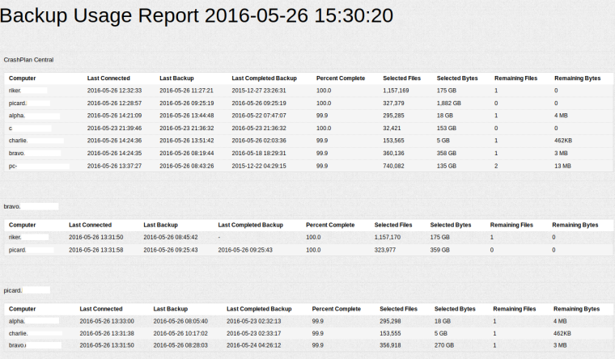

# CrashPlan Dashboard - Shows the status of your CrashPlan backups

Do you regularly back up your computers? I do, and I use CrashPlan for my backups. It's an excellent service which has saved me multiple times.

However, there is a shortcoming: the backup report emails are **atrocious**.

* you cannot get more than one report per day
* in at least half of the emails, the deltas for the Selected and Files column don't make any sense (the value in gray is equal to the value in black)
* the reporting period and the last activity times are misleading: on May the 5th I got an email referencing the period from May the 2nd to May the 3rd, but the last activity times are relative to May the 5th, so it looks like there were no backups for the last 2 days...

I've created this application to have always up-to-date backup reports by using the CrashPlan API. Just refresh the web page and see where your backups are, any time you want!



##Installation and Usage

To run the application, you will need to have JDK v8 installed. I developed and tested using Oracle's JDK (available at http://www.oracle.com/technetwork/java/javase/downloads/index.html), OpenJDK should work as well.

Download the most recent release, then run it with:

```
java -jar crashplan-report.jar
```

To generate a report, simply load [http://localhost:4567/](http://localhost:4567/) in your browser. The application will ask for your CrashPlan login and password at the first connection: the application uses those credentials only to authenticate itself to the CrashPlan API over a secure connection to https://www.crashplan.com, it never stores them anywhere nor it sends them elsewhere.

The report is organized by backup destination: for each destination there's a table summarizing the backup usage of each one of the computers that connect to it. You can sort the tables by clicking on the headers.

## Advanced Usage

The application listens by default on port 4567 on all interfaces. You can change the listening port with the `-Dport=...` syntax:

```
java -jar crashplan-report.jar -Dport=10000
```

The report refreshes automatically every 2 hours: if you need a different interval, pass the `refresh` parameter in the URL: `http://localhost:4567/?refresh=10`. The refresh parameter is in minutes, the minimum accepted value is `1`.
